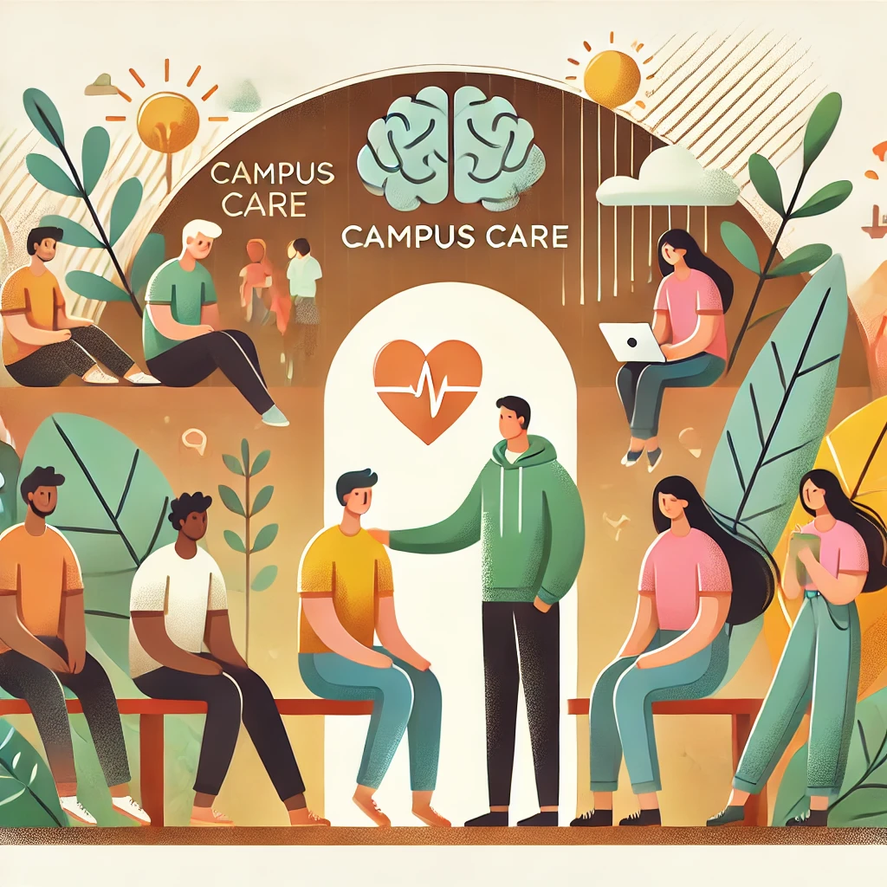

# CampusCARE

<br>
<p align="center">
  
</p>
<br>


## 🏫 Contexte
***CampusCARE*** est une association qui a pour but de préserver la santé mentale des étudiants dans le monde.

La direction de la filiale en Inde, après avoir effectué un ensemble d’entretiens avec des cellules psychologiques dans les campus, a observé au cours des derniers mois, ***une détérioration progressive de la santé mentale de ses étudiants***.

Afin de mieux comprendre les profils au sein des différents campus et suivre leur état mental, elle a effectué ***une enquête auprès des étudiants*** pour collecter les détails démographiques, facteurs psychologiques et style de vie.

L'association fait appel à une équipe de Data Analysts afin d’***identifier les facteurs contribuants à la dépression chez les étudiants***, et ***concevoir des stratégies d’intervention précoces***.

## 🎯 Objectifs
- Développer un tableau de bord interactif pour le suivi de KPIs (à définir).
- Identifier les facteurs contribuant à la dépression chez les étudiants.
- Concevoir des stratégies d’intervention précoces.
- Prédire le niveau de dépression des étudiants.
- Proposer une interface utilisateur simple pour prédire l'état de santé mentale d'un étudiant.

## 🛠️ Méthodologie
1. Nettoyage et préparation des données.
2. Analyse exploratoire des données.
3. Modélisation pour la prédiction.
4. Développement d'un tableau de bord interactif.
5. Prototypage d'une interface utilisateur.

- **[Détails Méthodologie](./docs/methodologie.md)** 

## 🚀 Livrables

- Définitions de KPI
- Recommandations de stratégies d'intervention anticipées
- Dashboard Interactif
- Modèle de prédiction de dépression (probalité)
- Interface utilisateur permettant la saisie

- **[Analyse Exploratoire (EDA), KPIs, Recommandations Stratégiques](./docs/eda.md)** 

## 📊 Description du DataSet

- ***27901*** réponses à l'enquête anonyme.
- **Descriptif des colonnes** ***(éléments de réponse de chaque étudiant.e)***

  - **Genre** : Féminin ou Masculin
  - **Age** : Age de l'étudiant.e
  - **Ville** : Résidence de l'étudiant.e pour ses études
  - **Pression académique** : de 0 à 5
  - **Pression professionnelle** : de 0 à 5 
  - **Durée de sommeil** : par tranche  
  - **Habitudes alimentaires** : Saines, Modérées, Saines 
  - **Satisfaction des études** : de 0 à 5  
  - **Stress financier** : de 0 à 5
  - **Antécédent familial de maladie mentale** : oui, non 
  - **Dépression** : 0 = pas de signe, 1 = présence de signes  
  - **CGPA** : Moyenne académique cumulée (échelle de 0 à 10)
  - **Niveau d'Etude** : Diplôme visé


## 📂 Structure du dépôt
```
CampusCARE/
├── donnees/                # Contient les données brutes et transformées
│   ├── brutes/             # Données brutes (non modifiées)
│   ├── nettoyees/          # Données nettoyées ou modifiées
├── scripts/                # Scripts Python pour le traitement, l'analyse et la modélisation
├── notebooks/              # Notebooks pour l'exploration et la visualisation des données
├── streamlit/              # Code pour l'interface utilisateur
├── dataviz/                # Graphiques, visualisations et rapport final
├── docs/                   # Documentation, Méthodologie
├── images/                 # Visuels, Captures d'écran, logos
└── README.md               # Description du projet
```

---

## 📜 Licence
- [**MIT**](./LICENSE)
