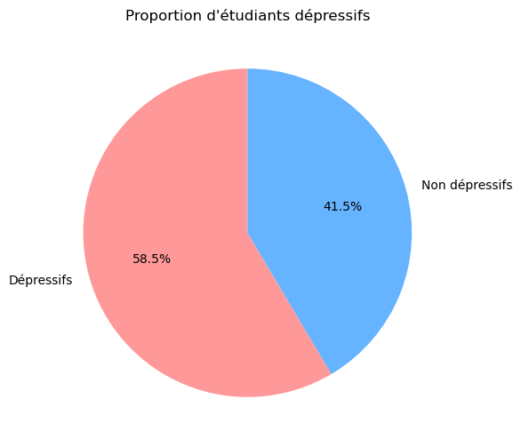
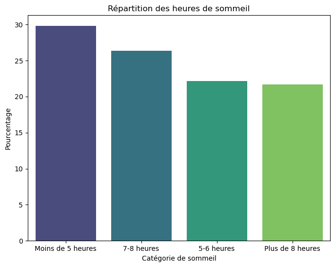
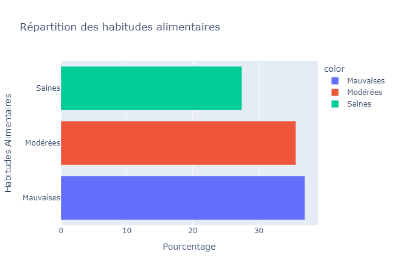
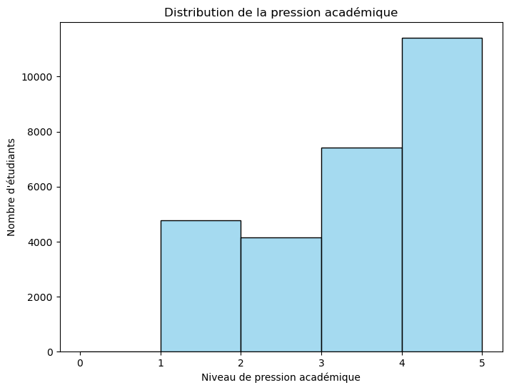
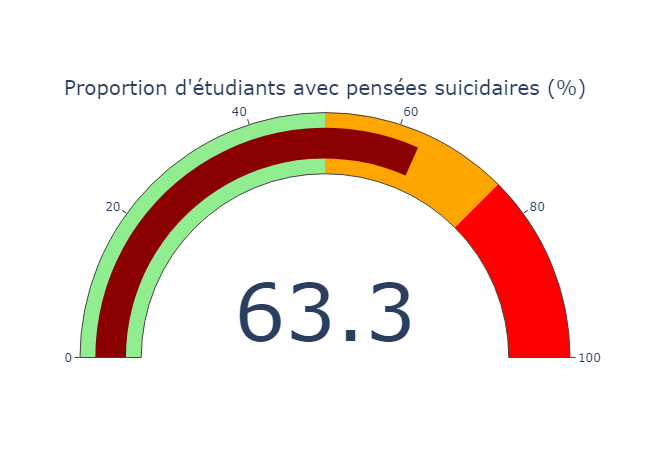
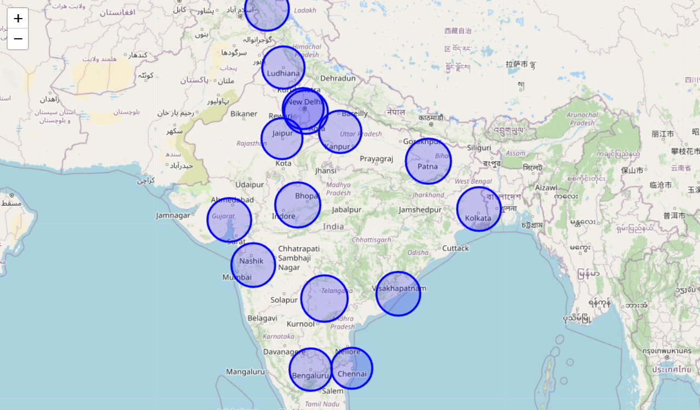

# Visualisations des KPIs

## Objectif
Créer des visualisations pertinentes et dynamiques pour les KPIs identifiés, afin de permettre leur intégration dans un tableau de bord interactif.

---


## Import des dataFrames


```python
import pandas as pd

df_kpi_final = pd.read_csv('../donnees/nettoyees/df_kpi_final.csv')
```


```python
df_kpi_final.head()
```


<div>
<table border="1" class="dataframe">
  <thead>
    <tr style="text-align: right;">
      <th></th>
      <th>Genre</th>
      <th>Age</th>
      <th>Ville</th>
      <th>Niveau étude</th>
      <th>Pression Académique</th>
      <th>CGPA</th>
      <th>Satisfaction Académique</th>
      <th>Temps de sommeil</th>
      <th>Habitudes Alimentaires</th>
      <th>Pensées Suicidaires</th>
      <th>Temps études/jour(heures)</th>
      <th>Stress Financier</th>
      <th>Antécédents familiaux mentaux</th>
      <th>Dépression</th>
      <th>Etat</th>
      <th>Population</th>
      <th>Latitude</th>
      <th>Longitude</th>
    </tr>
  </thead>
  <tbody>
    <tr>
      <th>0</th>
      <td>Homme</td>
      <td>33</td>
      <td>Visakhapatnam</td>
      <td>Bachelor</td>
      <td>5</td>
      <td>8.97</td>
      <td>2</td>
      <td>5-6 heures</td>
      <td>Saines</td>
      <td>True</td>
      <td>3</td>
      <td>1</td>
      <td>False</td>
      <td>1</td>
      <td>Andhra Pradesh</td>
      <td>969608</td>
      <td>17.7000</td>
      <td>83.2500</td>
    </tr>
    <tr>
      <th>1</th>
      <td>Femme</td>
      <td>24</td>
      <td>Bangalore</td>
      <td>Bachelor</td>
      <td>2</td>
      <td>5.90</td>
      <td>5</td>
      <td>5-6 heures</td>
      <td>Modérées</td>
      <td>False</td>
      <td>3</td>
      <td>2</td>
      <td>True</td>
      <td>0</td>
      <td>Karnataka</td>
      <td>15386000</td>
      <td>12.9789</td>
      <td>77.5917</td>
    </tr>
    <tr>
      <th>2</th>
      <td>Homme</td>
      <td>31</td>
      <td>Srinagar</td>
      <td>Bachelor</td>
      <td>3</td>
      <td>7.03</td>
      <td>5</td>
      <td>Moins de 5 heures</td>
      <td>Saines</td>
      <td>False</td>
      <td>9</td>
      <td>1</td>
      <td>True</td>
      <td>0</td>
      <td>Jammu &amp; Kashmir</td>
      <td>1180570</td>
      <td>34.0800</td>
      <td>74.8000</td>
    </tr>
    <tr>
      <th>3</th>
      <td>Femme</td>
      <td>28</td>
      <td>Varanasi</td>
      <td>Bachelor</td>
      <td>3</td>
      <td>5.59</td>
      <td>2</td>
      <td>7-8 heures</td>
      <td>Modérées</td>
      <td>True</td>
      <td>4</td>
      <td>5</td>
      <td>True</td>
      <td>1</td>
      <td>Uttar Pradesh</td>
      <td>1198491</td>
      <td>25.3200</td>
      <td>82.9900</td>
    </tr>
    <tr>
      <th>4</th>
      <td>Femme</td>
      <td>25</td>
      <td>Jaipur</td>
      <td>Master</td>
      <td>4</td>
      <td>8.13</td>
      <td>3</td>
      <td>5-6 heures</td>
      <td>Modérées</td>
      <td>True</td>
      <td>1</td>
      <td>1</td>
      <td>False</td>
      <td>0</td>
      <td>Rajasthan</td>
      <td>3073350</td>
      <td>26.9200</td>
      <td>75.7800</td>
    </tr>
  </tbody>
</table>
</div>


## **KPI 1** - Proportion d'étudiants dépressifs

### Méthodologie
- Visualisation d'un graphique en secteur pour représenter la proportion d'étudiants dépressifs.


```python
import matplotlib.pyplot as plt

# Calcul de la proportion d'étudiants dépressifs
kpi1_depression = df_kpi_final['Dépression'].mean() * 100

# Graphique en secteur
labels = ['Dépressifs', 'Non dépressifs']
sizes = [kpi1_depression, 100 - kpi1_depression]
colors = ['#ff9999', '#66b3ff']

plt.figure(figsize=(6, 6))
plt.pie(sizes, labels=labels, autopct='%1.1f%%', startangle=90, colors=colors)
plt.title("Proportion d'étudiants dépressifs")
plt.show()
```


    

    


---

## **KPI 2** - Répartition des heures de sommeil

### Méthodologie
- Utilisation d'un diagramme en barre pour visualiser la répartition des heures de sommeil.


```python
import seaborn as sns

# Répartition des heures de sommeil
kpi2_sommeil = df_kpi_final['Temps de sommeil'].value_counts(normalize=True) * 100

# Graphique en barre
plt.figure(figsize=(8, 6))
sns.barplot(x=kpi2_sommeil.index, y=kpi2_sommeil.values, palette="viridis")
plt.title("Répartition des heures de sommeil")
plt.xlabel("Catégorie de sommeil")
plt.ylabel("Pourcentage")
plt.show()
```
  


    

    


---

## **KPI 3** - Répartition des habitudes alimentaires

### Méthodologie
- Graphique interactif en barre horizontal pour représenter les habitudes alimentaires.


```python
import plotly.express as px

# Répartition des habitudes alimentaires
kpi3_alimentaire = df_kpi_final['Habitudes Alimentaires'].value_counts(normalize=True) * 100

# Graphique interactif
fig = px.bar(
    x=kpi3_alimentaire.values,
    y=kpi3_alimentaire.index,
    orientation='h',
    labels={'x': 'Pourcentage', 'y': 'Habitudes Alimentaires'},
    title="Répartition des habitudes alimentaires",
    color=kpi3_alimentaire.index
)
fig.show()
```





---

## **KPI 4** - Pression académique

### Méthodologie
- Histogramme pour visualiser la distribution des niveaux de pression académique.


```python
# Graphique de la pression académique
plt.figure(figsize=(8, 6))
sns.histplot(df_kpi_final['Pression Académique'], bins=5, color="skyblue")
plt.title("Distribution de la pression académique")
plt.xlabel("Niveau de pression académique")
plt.ylabel("Nombre d'étudiants")
plt.show()
```


    

    


---

## **KPI 5** - Proportion d'étudiants avec pensées suicidaires

### Méthodologie
- Utilisation d'une jauge interactive avec `plotly` pour visualiser la proportion d'étudiants ayant des pensées suicidaires.
- Cet indicateur permet de suivre l'ampleur de ce problème critique et d'adapter les stratégies d'intervention en conséquence.


```python
import plotly.graph_objects as go

# Proportion d'étudiants avec pensées suicidaires
ratio_suicide = df_kpi_final['Pensées Suicidaires'].mean() * 100

# Graphique en jauge
fig = go.Figure(go.Indicator(
    mode="gauge+number",
    value=ratio_suicide,
    title={'text': "Proportion d'étudiants avec pensées suicidaires (%)"},
    gauge={
        'axis': {'range': [0, 100]},
        'bar': {'color': "darkred"},
        'steps': [
            {'range': [0, 50], 'color': "lightgreen"},
            {'range': [50, 75], 'color': "orange"},
            {'range': [75, 100], 'color': "red"}
        ],
    }
))

fig.show()
```




---

## **KPI 6** - Carte interactive : Répartition géographique des étudiants dépressifs

### Méthodologie
- Carte interactive utilisant Folium pour identifier les régions les plus touchées.


```python
import folium

# Préparer les données pour Folium (en fonction du % de pensées suicidaires)
geo_data_suicide = df_kpi_final.groupby('Etat').agg({
    'Pensées Suicidaires': 'mean',
    'Latitude': 'mean',
    'Longitude': 'mean'
})
geo_data_suicide['Pensées Suicidaires'] = geo_data_suicide['Pensées Suicidaires'] * 100

# Carte interactive
map_suicide = folium.Map(location=[20.5937, 78.9629], zoom_start=5)
for index, row in geo_data_suicide.iterrows():
    folium.CircleMarker(
        location=(row['Latitude'], row['Longitude']),
        radius=row['Pensées Suicidaires'] / 2,  # Ajuster la taille pour un bon affichage
        color='blue',
        fill=True,
        fill_color='blue',
        tooltip=f"{index}: {row['Pensées Suicidaires']:.2f}%"
    ).add_to(map_suicide)

# Sauvegarder la carte
map_path = "../images/map_suicide.html"
map_suicide.save(map_path)

print("Carte interactive sauvegardée dans :", map_path)

```

    Carte interactive sauvegardée dans : ../images/map_suicide.html
    

```python
map_suicide
```




